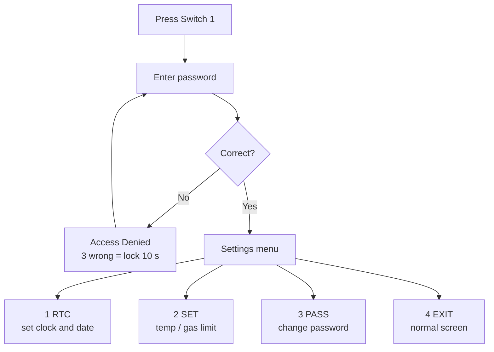

<h1 align="center">🔥 LPC2148 Kitchen Safety – Heat & Gas Monitoring System</h1>

<p align="center">
  A robust, password-protected real-time kitchen safety and hazard monitoring system powered by the <b>NXP LPC2148 (ARM7)</b> microcontroller.<br/>
  Features continuous <b>temperature & gas sensing</b>, <b>hardware RTC timestamping</b>, <b>external interrupt handling</b>, and a <b>secure configuration menu</b>.
</p>

<p align="center">
  
  
  
  
</p>

---

## 📸 Hardware Prototype Showcase
|**1.Complete Hardwarw Setup**|**2.Setup With Keypad**|
<div align="center">
 
|||


</div>

<p align="center"><em>Fully assembled physical prototype featuring the LPC2148 board, 16x2 LCD display, 4x4 matrix keypad, LM35 temperature sensor, MQ-2 gas sensor module, and active-high alert LED/buzzer system.</em></p>

---
## 🧰 Sensors and Equipments

<p align="center">
  
  
  
  
  
  
  
</p>

---

## 📑 Table of Contents

1. [Overview & Objectives](#-overview--objectives)
2. [System Architecture & Diagrams](#-system-architecture--diagrams)
3. [System File Structure](#-system-file-structure)
4. [Hardware & Pin Configuration](#-hardware--pin-configuration)
5. [Core Features & Functional Workflow](#core-features--functional-workflow)
6. [Software Requirements & Compilation](#software-requirements--compilation)
7. [Interactive Menu System & Configuration Workflow](#interactive-menu-system--configuration-workflow)
8. [Author](#author)

---

## 🎯 Overview & Objectives

Designed as an advanced embedded systems project, this application provides automated protection against kitchen hazards by monitoring thermal and atmospheric conditions:
* **Temperature Monitoring:** Continuously tracks ambient kitchen temperature via an **LM35** analog sensor connected to the on-chip ADC.
* **Gas Leakage Detection:** Senses combustible gases (LPG, smoke, methane) using an **MQ-2** gas sensor module[cite: 25, 26].
* **Multi-Modal Alerting:** Instantly activates an audible buzzer (`P1.27`) and a visual active-high alert LED (`P0.0`) upon threshold breaches.
* **Event Logging:** Records historical threshold-crossing events with precise hardware **RTC timestamps** and cycles them on the LCD screen every 10 seconds.

---

## 📊 System Architecture & Diagrams

### 1. System Block Diagram
The following block diagram illustrates the peripheral connections and core interfaces centered around the LPC2148 ARM7 microcontroller:

<p align="center">


</p>

### 2. System Workflow Flowchart
The execution flow governing real-time sensor sampling, interrupt response, password validation, and hazard management is detailed below:

```mermaid
graph TD
    A[Start: System Initialization] --> B[Display Welcome Banner & RTC Init]
    B --> C[Continuous Monitoring Loop]
    C --> D[Sample LM35 & MQ-2 via ADC Channels]
    D --> E[Fetch Hardware RTC Time & Date]
    E --> F{Check Hazards: Temp > Thresh OR Gas > Thresh?}
    
    F -- Yes --> G{Is Alert Silenced & No Higher Spike?}
    G -- No --> H[Turn ON Buzzer & Alert LED P0.0]
    H --> I[Record Peak Event Timestamp & Sensor Values]
    G -- Yes --> J[Maintain Muted State]
    
    F -- No --> K[Turn OFF Buzzer & Alert LED]
    K --> L[Reset Alert Silenced Flag]
    
    C --> M{Switch 1 Pressed? EINT1 Interrupt}
    M -- Yes --> N[Enter Secure Edit Mode]
    N --> O[Prompt Password via 4x4 Keypad]
    O --> P{Password Correct?}
    P -- No --> Q{Attempts < 3?}
    Q -- Yes --> O
    Q -- No --> R[10-Second Lockout Countdown & System Locked]
    P -- Yes --> S[Display Configuration Menu: RTC, Setpoint, Pass, Exit]
    S --> T[Update Parameters & Return to Monitoring]
    
    C --> U{Switch 2 Pressed? EINT0 Interrupt}
    U -- Yes --> V[Silence Buzzer & Turn OFF LED Immediately]
    
    C --> W[Update LCD Live Screen & 10s Event Log Timer]
    W --> C
   ```
## 📁 System File Structure
```text
lpc2148-kitchen-safety/
│
├── MINI_PROJECT_MAIN.c   # Main application loop, RTC management, event logging, & secure menus
├── Interrupts_Mini.c     # External interrupt service routines (EINT0 for Mute, EINT1 for Menu)
├── interrupts_Mini.h       # Interrupt function prototypes
│
├── ADC.c / ADC.h           # On-chip ADC configuration & multi-channel conversion drivers
├── ADC_defines.h           # ADC register bit definitions & clock divider macros
│
├── LM35.c / LM35.h         # LM35 temperature sensor reading & conversion formulas
├── MQ2.c / MQ2.h           # MQ-2 gas sensor sampling helpers
│
├── LCD.c / LCD.h           # 16x2 LCD drivers (commands, data, string/number formatters)
├── LCD_defines.h           # LCD instruction set & pin mappings
│
├── KPM.c / KPM.h           # Non-blocking 4x4 matrix keypad scanning engine with screen echo
├── KPM_defines.h           # Keypad row/column port mappings
│
├── Delay.c / delay.h       # Precise microsecond, millisecond, and second delay routines
├── types.h                 # Standardized typedefs (u32, u8, f32, etc.)
└── defines.h               # Bit-manipulation utility macros (SETBIT, CLRBIT, WRITEBYTE)
```
## 🔌 Hardware & Pin Configuration

| Peripheral | Microcontroller Pin / Port | Function & Description |
|---|---|---|
| **Alert LED** | `P0.0` (`ALLERT_LED`) | Active-high digital visual indicator |
| **Buzzer** | `P1.27` (`BUZ_PIN`) | Audible warning alarm |
| **Switch 2 (Mute)** | `P0.1` (`EXTINT0`) | External hardware interrupt for instant alarm muting |
| **Switch 1 (Menu)** | `P0.3` (`EXTINT1`) | External hardware interrupt to enter secure Edit Mode |
| **LM35 Sensor** | Analog Input (`CH0`) | Temperature analog voltage input |
| **MQ-2 Sensor** | Analog Input (`CH1`) | Gas concentration analog voltage input |
| **LCD Data Lines** | `P0.8` – `P0.15` | 8-bit data bus for the 16x2 character display |
| **LCD Control** | `P0.16` (RS), `P0.17` (RW), `P0.18` (EN) | LCD register select, read/write, and enable lines |
| **Keypad Rows/Cols**| `P1.16` – `P1.23` | 4x4 Matrix Keypad interface |

##  Core Features & Functional Workflow

### 🕒 1. Real-Time Monitoring & RTC Logging
* Continuously samples the **LM35** temperature sensor and **MQ-2** gas sensor via the on-chip ADC.
* Maintains precise time tracking using the hardware **RTC**, cycling recent threshold-crossing events onto the 16x2 LCD every 10 seconds.

### ⚡ 2. Interrupt-Driven External Control
* **Switch 2 (`EINT0`):** Instantly silences the active buzzer and turns off the alert LED (`P0.0`).
* **Switch 1 (`EINT1`):** Pauses normal monitoring to open the protected system configuration menu.

### 🔐 3. Secure Password Authentication & Lockout
* Requires passcode verification via the **4x4 matrix keypad** to modify system configurations.
* Features a built-in **3-attempt brute-force protection** that triggers a **10-second lockout countdown** on the LCD upon repeated failures.

### 🚨 4. Multi-Modal Hazard Alerting
* Automatically triggers an audible warning via the **buzzer (`P1.27`)** and a visual warning via the **active-high alert LED (`P0.0`)** when ambient temperature or gas levels exceed safety thresholds.

## Software Requirements & Compilation

### 🛠️ Software Tools
1. **Integrated Development Environment (IDE):** **Keil µVision (ARM/MDK)** for writing and compiling the Embedded C source files.
2. **Simulation & Flashing Tools:** 
   * **Proteus Design Suite** for testing circuit behavior and schematic-level simulation.
   * **Flash Magic** for uploading the compiled binary onto the physical Vector India LPC2148 board via UART.

---

### ⚙️ Step-by-Step Compilation Guide

1. **Create Project:** Open Keil µVision, create a new project, and select the **NXP LPC2148** (ARM7TDMI) microcontroller under the Philips/NXP device database.
2. **Add Source & Driver Files:** Add your application core and peripheral driver files to your project source group:
   * Main logic: `MINI_PROJECT_MAIN.c`, `Interrupts_Mini.c`
   * Drivers: `ADC.c`, `LCD.c`, `KPM.c`, `LM35.c`, `MQ2.c`, and `Delay.c`
3. **Configure Target Options:**
   * Go to **Options for Target** -> **Target** tab and set the Xtal (MHz) value to **12 MHz**.
   * Go to the **Output** tab and ensure **Create HEX File** is checked.
4. **Compile Project:** Press **F7** to build the solution. Ensure the build completes with **0 Errors and 0 Warnings**.
5. **Flash or Simulate:** Use the generated `.hex` file to run the simulation in Proteus or flash it onto your physical hardware board using Flash Magic.

---

##  Interactive Menu System & Configuration Workflow

Pressing **Switch 1 (`EINT1`)** interrupts live monitoring to launch the secure configuration panel. Below is the step-by-step breakdown matching your preview screens and operational flow.

---
### Access and Menu Flow
---


---
### 1. Password Verification & Security Handling

| Password entry | Wrong password | Three wrong tries |
| :---: | :---: | :---: |
||| |
| Digits appear as `*` | Access Denied and a short beep | Locked for 10 s with a countdown, then the password is asked again |

---

### 2. Settings
---

| Settings menu | 
| :---: |
| |
| Choose 1 to 4 |
> ⏱️ **Auto-Close Feature:** The menu closes by itself after 30 seconds without a key press.
---
### 3. Menu Options Reference Table
---
| Key | Option | What it does |
| :---: | :---: | :---|
| **1** | **RTC** | Set the clock and date (see RTC menu) |
| **2** | **SET** | `1.TEMP` – set the temperature limit (0–200 °C), `2.GAS` – set the gas limit (0–1000) |
| **3** | **PASS** | Change the password: enter the current password, then the new one, then confirm it |
| **4** | **EXIT** | Return to the normal screen |

---
### 3.RTC Menu
---
|RTC Menu|Time Menu|Date Menu|
|:---:|:---:|:---:|
|||
| Choose 1 to 3 | Set hour, minute, second| date, month, year |
---
### 4.Set Point
---
|Set Point Menu|Temp Value|Gas Value|
|---|---|---|
||||
| Choose 1 to 4 | Temperature Range is 1-200 | Gas range is 0-1000 |
> sVal Shows the temp_threshold & gas_threshold values

>  Press c For Clear a Digit
---
### 5.Set Password
---
| Enter Old Password | Verification Error | Enter New Password |
| :---: | :---: | :---: |
||||
| Prompts the user to enter their current system passcode | Displays warning message if the typed old password is incorrect | Prompts for the new passcode with character masking (`*`) |
## Author

**G Surendra Babu**  
* Bachelor of Technology in Electrical and Electronics Engineering  
* Embedded Systems Trainee at Vector India  
* [GitHub Profile](https://github.com/Surendra-Babu766)

<p align="center"><sub>⭐ If you found this project helpful or inspiring, please give it a star!</sub></p>
